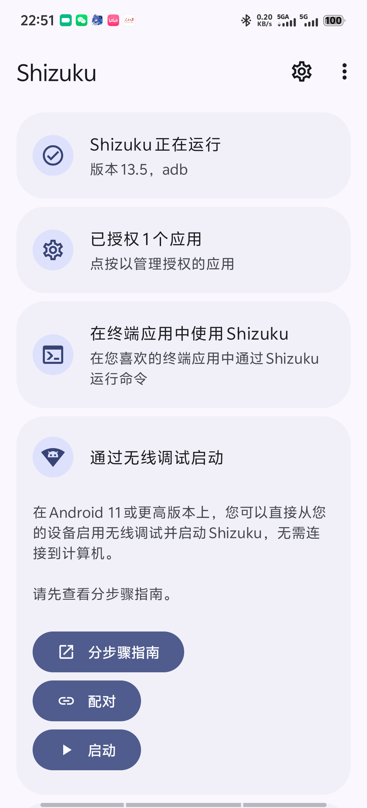
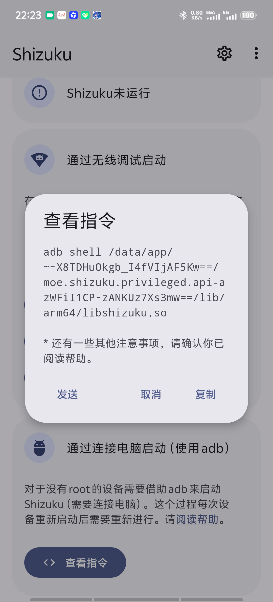
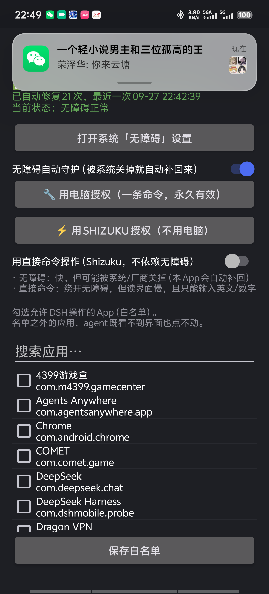
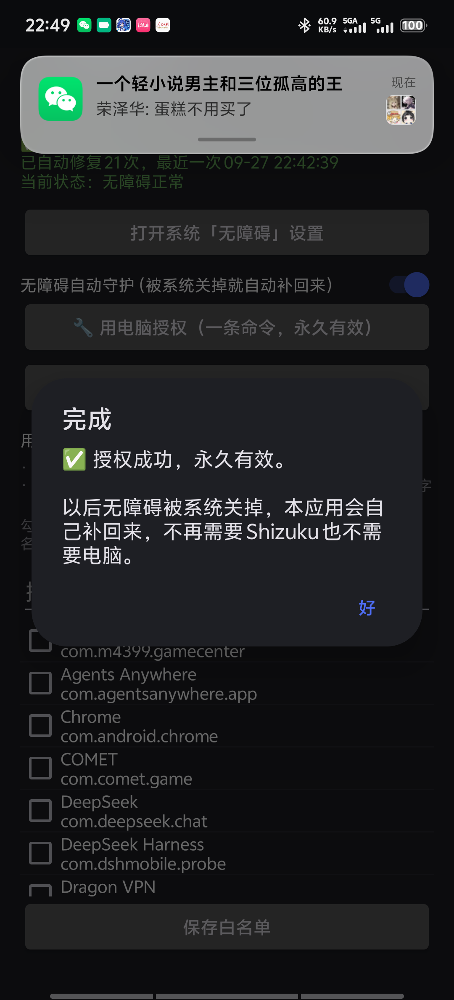

# Shizuku 授权完整教程（不用电脑）

> 这篇教程解决一件事：**让「无障碍自动守护」永久生效**，从此无障碍权限被系统或厂商
> 关掉时，App 能自己补回来。
>
> 全程**不需要电脑**。整个过程大约 3 分钟，做一次就永久有效。

---

## 零、先搞清楚：为什么需要这一步

先说不能做的，免得你白折腾：

> ❌ **任何 APK 都不可能"自带最高权限"。**

Shizuku 的权限来自 **ADB 或 root**，是**从应用外面拿进来的**。
这是安卓的安全模型本身：应用不能给自己提权。
Shizuku 官方开发文档第一句就是"你需要引导用户先安装 Shizuku 或 Sui"。
如果哪个 APK 声称装完就自带系统权限，那它要么在骗你，要么用了提权漏洞。

**能做的是把这一步压到最省事**，也就是这篇教程：

```
一次性授权  →  之后永久有效（重启手机、更新 App 都不会掉）
```

授权成功后，App 会拿到 `WRITE_SECURE_SETTINGS` 这一个权限，
仅用于**把你自己的无障碍开关写回去**。它不会碰别的东西。

**不想做这一步也完全能用**，只是无障碍被系统关掉后，需要你手动去设置里重开一次。

---

## 一、这个授权到底给了 App 什么

| | 有授权 | 没授权 |
|---|---|---|
| 无障碍被系统关掉后 | **0.3 秒内自动补回** | 需要你手动去设置里重开 |
| 授权会过期吗 | **不会**，重启、更新 App 都不掉 | — |
| 要重启后重做吗 | **不用** | — |
| Shizuku 要一直开着吗 | **不用**，授权完就可以不管它了 | — |

> 关键点：**Shizuku 只是"搬运工"**。
> 它替你跑一条命令，把权限交给 App；交完之后 Shizuku 就没用了，
> 关掉它、重启手机都不影响。

---

## 二、装 Shizuku

我们已经把安装包一起放进分享包里了，在 **`shizuku`** 文件夹里：

```
shizuku/
  ├─ shizuku-v13.6.0.r1086.2650830c-release.apk   ← 装这个
  ├─ LICENSE-Apache-2.0.txt                        ← 它的开源许可证
  └─ 来源与校验.txt                                 ← 来源说明和校验值
```

像装普通 App 一样点开安装即可（同样会遇到"未知来源"提示，选允许）。

> 💡 **不放心第三方安装包？** 完全可以理解 —— Shizuku 运行起来持有的可是 shell 级权限。
> 那就**别用我们这份**，去官方自己下载：
> <https://github.com/RikkaApps/Shizuku/releases>
> 文件名带 `release` 的那个。下好用 `来源与校验.txt` 里的 SHA-256 核对一下。

装完先**打开一次** Shizuku，你会看到主界面：

<p align="center"></p>

---

## 三、启动 Shizuku

Shizuku 装好只是"装好了"，**还没运行**。它必须由 ADB 或 root 启动 ——
因为它的全部意义就是从外面把权限拿进来。

三种方式，**挑一种**：

| 你的情况 | 用哪个方式 | 要电脑吗 | 重启后 |
|---|---|---|---|
| Android 11 及以上，没 root | **方式 B · 无线调试** | **不用** | 要重新启动一次 |
| 有电脑（任意安卓版本） | 方式 A · 连电脑 | 要 | 要重新启动一次 |
| 有 root | 方式 C · root | 不用 | 自动，不用管 |

---

### 方式 B · 无线调试启动（推荐，不用电脑）

**适用于 Android 11 及以上。** 在 Shizuku 主界面的「通过无线调试启动」区域操作。

#### 第 1 步 · 打开开发者选项和无线调试

在手机的系统设置里：

1. 设置 → 关于手机 → 连续点「版本号」7 次 → 提示"您已处于开发者模式"
2. 设置 → 系统 → 开发者选项 → 打开 **「USB 调试」**
3. 在同一页找到并打开 **「无线调试」**

> 不同品牌路径略有不同，找不到就在设置里搜"开发者选项"。

#### 第 2 步 · 配对（只需做一次）

1. 在 Shizuku 里点 **「配对」**
2. 系统会跳到「无线调试」页面 → 点 **「使用配对码配对设备」**
3. 手机上会显示一个 **6 位配对码**
4. 下拉通知栏，在 Shizuku 的通知里**输入这个配对码**

<p align="center">
  
</p>

> ⚠️ **配对要快**。那个配对码窗口和通知都有时限，超时了就关掉重来。
>
> ⚠️ 配对时**别把无线调试页面切走**，也不用关掉它 —— 直接从通知栏输入即可。

#### 第 3 步 · 启动

回到 Shizuku，点 **「启动」**。

启动成功后，主界面顶部会变成 **「Shizuku 正在运行 / 版本 xx, adb」**。

> 如果点了没反应：把「无线调试」关掉再打开，然后再点一次「启动」。
> 这是官方 FAQ 里给的办法。

---

### 方式 A · 连电脑启动（任意安卓版本）

**适用于没有无线调试的老手机，或者你手边正好有电脑。**
缺点很明确：**每次手机重启后都要重做一次**。

1. 手机打开「开发者选项」→「USB 调试」
2. 用数据线连上电脑，手机上弹出"允许 USB 调试吗"→ 勾选"始终允许"→ 确定
3. 电脑上装好 `adb`（搜索 "SDK Platform Tools" 下载解压即可）
4. 在 Shizuku 里点 **「查看指令」**，它会显示一条命令，类似：

<p align="center"></p>

5. 把那条命令复制到电脑的终端里执行

> 📌 **一定要以 Shizuku 里显示的那条为准**。
> 不同版本的命令不一样（老版本是一个 `start.sh`，13.6 起变成了直接运行
> `libshizuku.so`），而且路径里带安装目录的哈希值，**每台手机都不同**。
>
> 网上很多教程还停留在旧版本，照抄会报
> `No such file or directory`。

---

### 方式 C · 有 root

打开 Shizuku 就会自动启动，而且**重启后能自启**，最省事。
如果手机有 root，直接用这个，前面两步都可以跳过。

---

## 四、回到本 App 完成授权

Shizuku 跑起来之后，回到 DeepSeek Harness：

**① 打开「手机控制」页**

左上角鲸鱼图标 → 设置 → **📱 手机控制（本机）**

<p align="center"></p>

**② 点「⚡ 用 Shizuku 授权（不用电脑）」**

App 会先弹一个说明框：

> **需要你允许一下**
> 马上会弹出 Shizuku 的授权窗口，请选择「允许」。
> 允许之后本应用就能以 shell 身份执行一条命令，给自己拿到那次性的权限，
> 之后就再也不需要 Shizuku 了。
>
> 　　[好，弹窗吧]　[取消]

点 **「好，弹窗吧」**。

**③ 在 Shizuku 的弹窗里选「始终允许」**

> **要允许 DeepSeek Harness 使用 Shizuku 吗？**
>
> 　　　　[始终允许]
> 　　　　[拒绝]

这里要选 **「始终允许」**（不是"仅本次"），否则下次还得再来一遍。

**④ 完成**

<p align="center"></p>

看到 **「✅ 授权成功，永久有效」** 就好了。

---

## 五、验证一下

回到「📱 手机控制」页，顶部应当显示：

```
✅ 无障碍服务：已开启
✅ 自动守护：已开启 —— 被系统关掉会自动补回来
已自动修复 N 次，最近一次 xx-xx xx:xx:xx
当前状态：无障碍正常
```

**「已自动修复 N 次」这个数字会一直累加**（跨重启、跨 App 更新都保留），
你可以过几天回来看看它替你挡了多少次。

---

## 六、常见问题

**Q：授权之后还需要让 Shizuku 一直开着吗？**
A：**不需要。** Shizuku 只是替你跑一条 `pm grant` 命令，跑完就没它事了。
授权结果保存在系统里，Shizuku 停了、手机重启了都不影响。

**Q：手机重启后，Shizuku 显示"未运行"，要重做吗？**
A：**只有用 Shizuku 做的事需要重做**（比如"直接命令"后端）。
**无障碍自愈不需要** —— 授权是持久的。

**Q：手机上根本装不了 Shizuku / 不想装，怎么办？**
A：用**电脑**跑一条命令效果完全一样（见「第八节」）：
```
adb shell pm grant com.dshmobile.probe android.permission.WRITE_SECURE_SETTINGS
```
同样是一次性、永久有效。

**Q：Shizuku 会不会有安全风险？**
A：它跑起来确实持有 shell 级权限，能做的事远超普通应用。
所以：**只从官方或你信任的渠道装**，装完用我们给的 SHA-256 核对一下。
本 App 只用它执行一条 `pm grant` 命令，不用它做别的。

**Q：连接无线调试时一直"正在搜索配对服务"怎么办？**
A：官方 FAQ 说这是后台被限制了。去系统设置里把 **Shizuku 的"允许后台运行"** 打开
（电池 → 后台高耗电 / 自启动），再重试。

**Q：输入配对码后立刻失败？**
A：小米 / Redmi 用户：把通知样式从"通知"改成 **"Android"**
（设置 → 通知 → 通知样式）。其他品牌见 Shizuku 官方 FAQ。

**Q：授权后点了「用直接命令操作」却说 Shizuku 不可用？**
A：那个开关需要 **Shizuku 当时正在运行**（它每次都要现场执行命令，
和无障碍自愈不一样）。启动一下 Shizuku 即可。

---

## 七、看不见效果？

如果你**从来没有遇到过大面积的无障碍被关**，那可能是因为：

- 你的手机品牌没有这种反诈策略（主要是 **vivo / iQOO** 上有）；
- 或者你还没用过会被触发的应用。

这时候不做这一步也完全没问题 —— 「已自动修复 0 次」本身就是好消息。

---

## 八、附：用电脑授权（不需要 Shizuku）

如果只是想要那一个权限，电脑 + 数据线是最直接的：

```
adb shell pm grant com.dshmobile.probe android.permission.WRITE_SECURE_SETTINGS
```

- 需要先开「开发者选项 → USB 调试」并连上电脑；
- 同样是**一次性**的，之后永久有效，重启也不掉；
- 想看当前有没有授权，在 App 的「手机控制」页看第一段状态即可：
  显示「✅ 自动守护：已开启」就是有。

---

*本教程对应 DeepSeek Harness 安卓版 0.1.12。Shizuku 版权归 Rikka 及贡献者所有，Apache-2.0 许可。*
