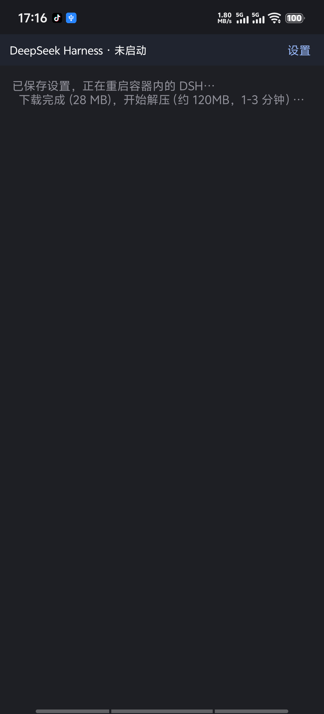

 DeepSeek Harness 安卓版 · 安装与使用说明

这是一个把 **DeepSeek Harness（DSH）完整装进手机里**的 App。
装好之后 DSH 就跑在你手机本地（一个内置的 Linux 容器里），
**不需要电脑、不需要服务器**，关掉网络也能打开界面（对话本身需要联网）。

---

## 一、安装前先确认两件事

| 条件 | 要求 |
|---|---|
| 手机芯片 | **ARM64**（最近五六年的手机基本都是）。这个包只带了 arm64 的运行时 |
| 安卓版本 | **Android 7.0 及以上** |
| 磁盘空间 | 预留 **1 GB** 以上（首次启动要下载并解压约 150 MB） |
| DeepSeek API Key | 需要你自己在 [platform.deepseek.com](https://platform.deepseek.com) 申请一个 |

**手机和平板用的是同一个安装包**，不用另找平板版。

> 这个 App 没有上架任何应用商店，属于**侧载安装**，所以安装时系统会提示
> "未知来源 / 未经人工亲测"。这是正常的。

---

## 二、安装

1. 把 `DeepSeek-Harness-0.1.12.apk` 传到手机上（微信/QQ 传文件、数据线拷贝都行），点击安装。
2. 系统会弹"是否允许安装未知应用" → 允许。
3. **如果你用的是 vivo / iQOO**，还会多一步"超级守护"提示，见下图 👇

点那句话里的蓝色链接 **「授权本次安装」**（注意是点文字链接，不是底部的"取消安装"按钮）。
其他品牌（小米/华为/OPPO）也会有类似的"风险提示"，选"继续安装 / 仍然安装"即可。

---

## 三、第一次打开：要等 1~3 分钟

首次启动时 App 会把运行环境装好，界面上会显示进度：

这一步在**下载并解压 Ubuntu 基础系统 + Node.js**，然后自动安装 DSH。
**请保持联网、不要退出 App**，大约 1~3 分钟（取决于网速）。
以后再打开就是秒开，不用再等。

---

## 四、三步就能开始用

### 第 1 步 · 填 API Key（第一次必须要）

App 会**自动弹出**一个 "DeepSeek API Key" 对话框，把 `sk-` 开头的 Key 粘进去，
点「保存并重启 DSH」。

> 如果当时点了取消，之后可以这样找回来：
> 左上角**鲸鱼图标** → 抽屉左下角 **设置** → **API Key（本机）**

Key 只存在你手机本地的 App 私有目录里，不会上传到任何地方。

### 第 2 步 · 同意 DSH 的内测声明

点 **「继续」** 即可。

### 第 3 步 · 选一个工作区

必须选一个文件夹，DSH 才知道读写文件的位置。
对话框里有几个**快捷入口**，推荐直接点 **「📂 dsh 工作区」**：

点完会进入一个可浏览的目录列表，再点 **「✓ 选择此目录」** 确认。
（也可以点「📱 手机存储」从整个手机存储里挑。）

选好之后，底部输入框就能打字了 —— **到这里就可以正常对话了**。

---

## 五、它能做什么

- **像正常聊天一样对话**，可以上传附件（图片 / 文档 / 音频都行）；
  点输入框左边的 **「+」** 会拉起手机的文件管理器让你选。
- **读写手机里的文件**：`/sdcard` 就是你的手机存储根目录。
  可以直接说"帮我把 Download 里的 xxx.docx 改一下标题"。
- **让它帮你操作手机上的 App**（需要额外开一个权限，见下一节）。

---

## 六、可选：让 DSH 操作手机 App

这个能力**默认关闭**，而且**只能操作你自己勾选过的 App** ——
没勾选的应用，它连界面都读不到。这是刻意的安全边界。

**① 开启无障碍服务**

设置 → 无障碍 → 找到 **「DeepSeek Harness」** → 打开。
（也可以在 App 内：设置 → 📱 手机控制 → 「打开系统无障碍设置」直接跳过去。）

**② 勾选允许操作的应用**

设置 → **📱 手机控制（本机）** → 搜索并勾选 App → 点底部 **「保存白名单」**。

**③ 建议做一次「无障碍守护」授权（只需一次，永久有效）**

vivo / iQOO 这类手机会在 QQ、微信切到前台时，把系统的无障碍开关**自动关掉**
（厂商的反诈策略）。App 能自己把它补回来，但需要一次性授权：

**设置 → 📱 手机控制 → 「🔧 用电脑授权」或「⚡ 用 Shizuku 授权」**

| 你的情况 | 怎么做 |
|---|---|
| 没有电脑（Android 11 及以上） | 装 **Shizuku**（已随包附带）、在手机上启动它，再点 App 里的「⚡ 用 Shizuku 授权」 |
| 有电脑 | 按提示把那条命令复制到电脑上执行一次 |
| 有 root | 打开 Shizuku 会自动启动，最省事 |

> 📖 **详细的图文步骤见同目录下的 `Shizuku授权教程.md`** ——
> 从装 Shizuku、启动它（不用电脑）、到在 App 里点授权，每一步都有截图和常见问题。
> Shizuku 的安装包就在分享包的 **`shizuku/`** 文件夹里，
> 那一份还附了来源说明和 SHA-256 校验值，你可以自己核对。

授权后，「手机控制」页面会显示 **✅ 自动守护：已开启**，
并累计显示"已自动修复 N 次"。

> 不想让它自动补？同一页有「无障碍自动守护」开关，关掉后 App 就不再碰无障碍设置。
> 我们刻意留了这个开关 —— 否则你去系统里关权限、3 秒后被默默开回来，那是流氓行为。

**没做这一步也完全能用**，只是无障碍被系统关掉后，需要你手动去设置里重开一次。

**④ 直接对它说人话**

> "打开 QQ，帮我看看有没有新消息"
> "在 DeepSeek 里新建一个对话"

它内部有一个 `phone` 命令（读界面 / 点击 / 滑动 / 输入文字 / 打开白名单内的 App），
你可以直接说需求，也可以自己写 `phone status` 这类命令。

**⑤ 可选：换一种操作方式（不用无障碍）**

同一页还有一个开关 **「用直接命令操作（Shizuku）」**。两条路各有取舍：

| | 无障碍服务（默认） | 直接命令（Shizuku） |
|---|---|---|
| 读界面速度 | 快 | **慢**（每次要等一两秒） |
| 输入中文 | 支持 | **不支持**，只能输英文和数字 |
| 被厂商关掉 | 会（本 App 自动补回） | **不受影响** |

**建议**：先用默认的无障碍。只有当你在某些 App 上反复遇到"权限被关"、
而且那个 App 可读时，再考虑切到直接命令。

> ⚠️ 实测**微信的界面读不出来**（无障碍和直接命令两条路都读不到）——
> 这是微信自己屏蔽的，不是本 App 的问题。QQ 情况类似。
> 其他普通 App（笔记、阅读器、学习类 App 等）两条路都正常。

---

## 七、常见问题

**Q：一直卡在"正在启动 dsh web…"**
A：第一次要下载约 150 MB，耐心等；确认手机联网、且没有开省电模式限制后台。

**Q：发消息报错 / 一直没回复**
A：多半是 API Key 没填或填错。设置 → API Key（本机）里重新填一次。
另外确认你的 DeepSeek 账户还有余额。

**Q：切到别的 App 再回来，DSH 要重新加载**
A：正常情况下不会。如果频繁发生，去系统设置里把本 App 的
「电池 → 后台高耗电 / 允许后台运行」打开，并允许「自启动」。

**Q：上传附件点「+」没反应**
A：确认是 0.1.0 及以上版本。

**Q：界面能打开，但一直显示「未连接」，或者选工作区时一直转圈「正在加载工作区…」**
A：你的系统 WebView 版本太旧（低于 Chrome 116）。装上 **0.1.9** 即可 ——
这一版补齐了缺失的浏览器 API，界面和网络请求都能恢复正常。

**Q：怎么知道自己手机的 WebView 版本？**
A：App 内左上角**鲸鱼图标** → 设置 → 最下面 **「复制日志」**，
把内容发给我即可（里面包含 WebView 版本号）。

**Q：平板能用吗？要装专门平板版吗？**
A：能用，而且**就是同一个安装包**。早期版本在宽屏上会跳过一部分界面优化
（比如回车变成直接发送），0.1.9 已经把跟屏幕宽度无关的优化全部改成
手机平板通用；平板上本来就该有的常驻侧边栏、双栏设置也保持原样。

**Q：怎么换工作区 / 换模型**
A：输入框上方有「工作区」和「标准模式」两个下拉，直接点。

**Q：无障碍权限老是掉，每次都要手动去开**
A：装上 **0.1.10** 并按第六节做一次授权（电脑一条命令，或 Shizuku 点一下）。
之后被系统关掉会在 0.3 秒内自动补回来。

**Q：为什么不能像某些 App 那样"装完就自带最高权限"？**
A：因为那在安卓上不存在。系统权限只能由系统或 ADB/root 授予，
任何 APK 都不可能给自己发权限 —— 能做到的话那叫提权漏洞。
所以我们把步骤压到最少：**一次性授权，之后永久有效**。

---

## 八、它不做什么

- 不需要 root。
- **不会偷偷**改你的无障碍设置：设置页有明确的开关，关掉就完全停手。
- 只把**自己**的服务写回无障碍列表，不会去动你开的其他无障碍应用。
- App 私有目录之外只访问你主动指定的文件（`/sdcard` 下的内容）。
- API Key 只存在本机，不经过任何第三方服务器。

---

*版本 0.1.12 · 基于 DSH 0.1.5-rc.3*
