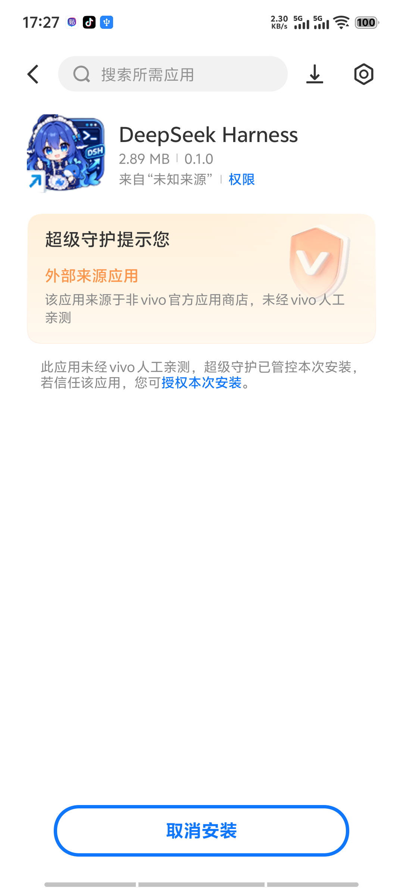
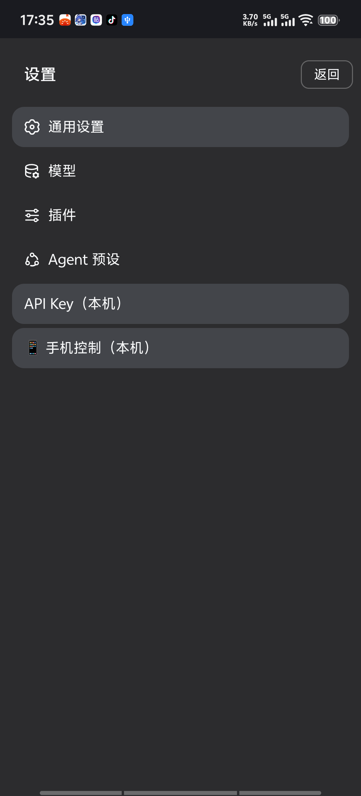
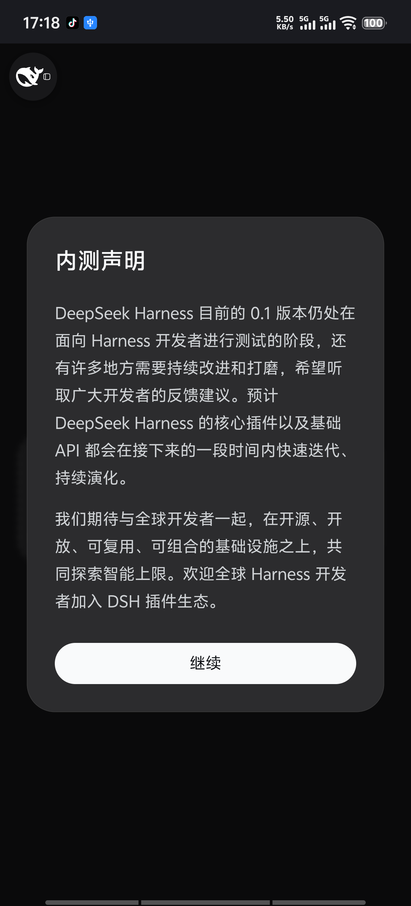
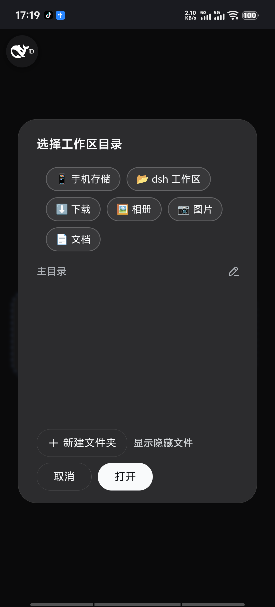
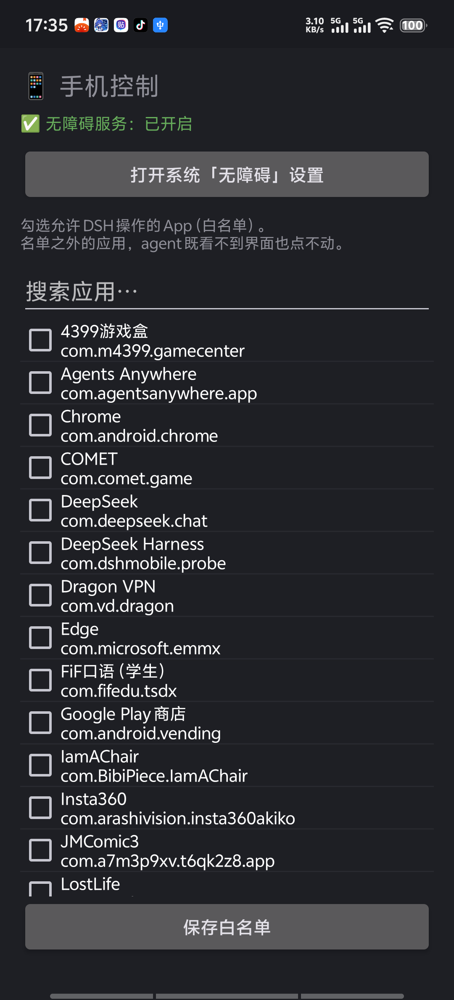

 DeepSeek Harness 安卓版 · 安装与使用说明

这是一个把 **DeepSeek Harness（DSH）完整装进手机里**的 App。
装好之后 DSH 就跑在你手机本地（一个内置的 Linux 容器里），
**不需要电脑、不需要服务器**，关掉网络也能打开界面（对话本身需要联网）。

---

## 一、安装前先确认两件事

| 条件 | 要求 |
|---|---|
| 手机芯片 | **ARM64**（最近五六年的手机基本都是）。这个包只带了 arm64 的运行时 |
| 安卓版本 | **Android 7.0 及以上** |
| 磁盘空间 | 预留 **1 GB** 以上（首次启动要下载并解压约 150 MB） |
| DeepSeek API Key | 需要你自己在 [platform.deepseek.com](https://platform.deepseek.com) 申请一个 |

**手机和平板用的是同一个安装包**，不用另找平板版。

> 这个 App 没有上架任何应用商店，属于**侧载安装**，所以安装时系统会提示
> "未知来源 / 未经人工亲测"。这是正常的。

---

## 二、安装

1. 把 `DeepSeek-Harness-0.2.7.apk` 传到手机上（微信/QQ 传文件、数据线拷贝都行），点击安装。
2. 系统会弹"是否允许安装未知应用" → 允许。
3. **如果你用的是 vivo / iQOO**，还会多一步"超级守护"提示，见下图 👇

点那句话里的蓝色链接 **「授权本次安装」**（注意是点文字链接，不是底部的"取消安装"按钮）。
其他品牌（小米/华为/OPPO）也会有类似的"风险提示"，选"继续安装 / 仍然安装"即可。

---

## 三、第一次打开：要等 1~3 分钟

首次启动时 App 会把运行环境装好，界面上会显示进度：

这一步在**下载并解压 Ubuntu 基础系统 + Node.js**，然后自动安装 DSH。
**请保持联网、不要退出 App**，大约 1~3 分钟（取决于网速）。
以后再打开就是秒开，不用再等。

---

## 四、三步就能开始用

### 第 1 步 · 填 API Key（第一次必须要）

App 会**自动弹出**一个 "DeepSeek API Key" 对话框，把 `sk-` 开头的 Key 粘进去，
点「保存并重启 DSH」。

> 如果当时点了取消，之后可以这样找回来：
> 左上角**鲸鱼图标** → 抽屉左下角 **设置** → **API Key**
> （平板等宽屏设备：设置入口在**左下角的齿轮图标**）

Key 只存在你手机本地的 App 私有目录里，不会上传到任何地方。

### 第 2 步 · 同意 DSH 的内测声明

点 **「继续」** 即可。

### 第 3 步 · 选一个工作区

必须选一个文件夹，DSH 才知道读写文件的位置。
对话框里有几个**快捷入口**，推荐直接点 **「📂 dsh 工作区」**：

点完会进入一个可浏览的目录列表，再点 **「✓ 选择此目录」** 确认。
（也可以点「📱 手机存储」从整个手机存储里挑。）

选好之后，底部输入框就能打字了 —— **到这里就可以正常对话了**。

---

## 五、它能做什么

- **像正常聊天一样对话**，可以上传附件（图片 / 文档 / 音频都行）；
  点输入框左边的 **「+」** 会拉起手机的文件管理器让你选。
- **读写手机里的文件**：`/sdcard` 就是你的手机存储根目录。
  可以直接说"帮我把 Download 里的 xxx.docx 改一下标题"。
- **右侧栏的「手机文件」标签页**（0.2.3 新增）：像文件管理器一样浏览手机存储，
  多选之后点「加入会话」，文件路径就进输入框了 —— 不用再手打长路径。
  它是**只读**的，只能看和选，不会删改你的文件。
- **让它帮你操作手机上的 App**（需要额外开一个权限，见下一节）。

---

## 六、可选：让 DSH 操作手机 App

这个能力**默认关闭**，而且**只能操作你自己勾选过的 App** ——
没勾选的应用，它连界面都读不到。这是刻意的安全边界。

**① 开启无障碍服务**

设置 → 无障碍 → 找到 **「DeepSeek Harness」** → 打开。
（也可以在 App 内：设置 → **手机权限** → 手机控制 → 「打开系统无障碍设置」直接跳过去。）

**② 勾选允许操作的应用**

设置 → **手机权限** → **手机控制** → 搜索并勾选 App → 点底部 **「保存白名单」**。

**③ 建议做一次「无障碍守护」授权（只需一次，永久有效）**

vivo / iQOO 这类手机会在 QQ、微信切到前台时，把系统的无障碍开关**自动关掉**
（厂商的反诈策略）。App 能自己把它补回来，但需要一次性授权：

**设置 → 手机权限 → 手机控制 → 「🔧 用电脑授权」或「⚡ 用 Shizuku 授权」**

| 你的情况 | 怎么做 |
|---|---|
| 没有电脑（Android 11 及以上） | 装 **Shizuku**（已随包附带）、在手机上启动它，再点 App 里的「⚡ 用 Shizuku 授权」 |
| 有电脑 | 按提示把那条命令复制到电脑上执行一次 |
| 有 root | 打开 Shizuku 会自动启动，最省事 |

> 📖 **详细的图文步骤见同目录下的 `Shizuku授权教程.md`** ——
> 从装 Shizuku、启动它（不用电脑）、到在 App 里点授权，每一步都有截图和常见问题。
> Shizuku 的安装包就在分享包的 **`shizuku/`** 文件夹里，
> 那一份还附了来源说明和 SHA-256 校验值，你可以自己核对。

授权后，「手机控制」页面会显示 **✅ 自动守护：已开启**，
并累计显示"已自动修复 N 次"。

> 不想让它自动补？同一页有「无障碍自动守护」开关，关掉后 App 就不再碰无障碍设置。
> 我们刻意留了这个开关 —— 否则你去系统里关权限、3 秒后被默默开回来，那是流氓行为。

**没做这一步也完全能用**，只是无障碍被系统关掉后，需要你手动去设置里重开一次。

**④ 直接对它说人话**

> "打开 QQ，帮我看看有没有新消息"
> "在 DeepSeek 里新建一个对话"

它内部有一个 `phone` 命令（读界面 / 点击 / 滑动 / 输入文字 / 打开白名单内的 App），
你可以直接说需求，也可以自己写 `phone status` 这类命令。

**⑤ 可选：换一种操作方式（不用无障碍）**

同一页还有一个开关 **「用直接命令操作（Shizuku）」**。两条路各有取舍：

| | 无障碍服务（默认） | 直接命令（Shizuku） |
|---|---|---|
| 读界面速度 | 快 | **慢**（每次要等一两秒） |
| 输入中文 | 支持 | **不支持**，只能输英文和数字 |
| 被厂商关掉 | 会（本 App 自动补回） | **不受影响** |

**建议**：先用默认的无障碍。只有当你在某些 App 上反复遇到"权限被关"、
而且那个 App 可读时，再考虑切到直接命令。

> 💡 **微信 / QQ 的界面读不出来？现在可以了。**
> 它们会屏蔽"控件树"，但屏幕本身是可以截的 ——
> agent 会自动改用**截图**去看，再用识图能力读出里面的内容。
> 这是 0.1.13 起的新能力，不需要你做任何设置。

**⑥ 可选：装社区插件（插件市场）**

**DSH 设置 → 手机权限 → 插件市场** 里可以搜索并一键安装社区写的插件
（主题、费用统计、搜索增强、余额挂件……）。

> 📖 完整的用法、安全提醒和常见问题见同目录下的 **`插件市场说明.md`**。
>
> ⚠️ 一句话提醒：**装插件 = 让第三方代码在你手机里运行**。
> 只装你信得过的，装之前界面会再确认一次。

---

## 七、常见问题

**Q：一直卡在"正在启动 dsh web…"**
A：第一次要下载约 150 MB，耐心等；确认手机联网、且没有开省电模式限制后台。

**Q：发消息报错 / 一直没回复**
A：多半是 API Key 没填或填错。设置 → API Key 里重新填一次。
另外确认你的 DeepSeek 账户还有余额。

**Q：切到别的 App 再回来，DSH 要重新加载**
A：正常情况下不会。如果频繁发生，去系统设置里把本 App 的
「电池 → 后台高耗电 / 允许后台运行」打开，并允许「自启动」。

**Q：上传附件点「+」没反应**
A：确认是 0.1.0 及以上版本。

**Q：界面能打开，但一直显示「未连接」，或者选工作区时一直转圈「正在加载工作区…」**
A：你的系统 WebView 版本太旧（低于 Chrome 116）。装上 **0.1.9** 即可 ——
这一版补齐了缺失的浏览器 API，界面和网络请求都能恢复正常。

**Q：怎么知道自己手机的 WebView 版本？**
A：App 内左上角**鲸鱼图标** → 设置 → 最下面 **「复制日志」**，
把内容发给我即可（里面包含 WebView 版本号）。

**Q：平板能用吗？要装专门平板版吗？**
A：能用，而且**就是同一个安装包**。早期版本在宽屏上会跳过一部分界面优化
（比如回车变成直接发送），0.1.9 已经把跟屏幕宽度无关的优化全部改成
手机平板通用；平板上本来就该有的常驻侧边栏、双栏设置也保持原样。

**0.2.6 起**，平板竖屏（约 800dp 这一档）的**会话列表也会默认展开** ——
以前这一档 DSH 只显示一条图标轨道，会话列表根本没渲染出来，用户会找不到会话。
现在打开就是完整侧边栏（新会话 / 插件 / 工作区 + 会话列表 / 设置）。
你要是习惯清爽一点，点侧边栏上的收起按钮收起来就行，**App 不会跟你抢**。

**Q：怎么换工作区 / 换模型**
A：输入框上方有「工作区」和「标准模式」两个下拉，直接点。

**Q：侧边栏里点某条会话，为什么第一次没反应？**
A：**这个行为已经在 0.1.21 去掉了**，现在点一次就切过去（见下）。

0.1.14 到 0.1.20 之间确实改成了**两次点击**：第 1 次点亮那一行、右边冒出「…」，
第 2 次才真的切走。当时的理由是"手机上「…」只有在被点到的那一刻才出现，
而这一次点击早被算成进会话了"。

0.1.21 起换了个更简单的做法：**「…」常显**。于是

- **单击会话行** → 立刻切换会话（跟桌面端一致）；
- **点右边的「…」** → 弹出「置顶 / 重命名 / 分叉 / 归档」；
- 两者互不干扰，也不需要"先点一次亮出来"。

> 顺带说明：DSH 的菜单带了 `closeOnPointerLeave`，手指一抬菜单就关 ——
> 所以"长按出菜单"在触屏上做不出来，这也是当时绕成两次点击的原因。
> 常显「…」既解决了这个问题，也没有多点一次的代价。

**Q：装了个插件之后，界面白屏 / 一直显示 Failed to load plugins，进不去了？**
A：**0.2.7 起，App 会自己把它停掉，你什么都不用点。**

原因：DSH 0.2 改过一批内部服务名（比如 `settingsScope` 变成了 `settings`）。
**为 0.1.x 写的插件**会一直等一个已经不存在的服务，前端就永远停在 pending，
整个界面起不来。这不是你操作错了，也不是 App 坏了 —— 是那个插件与当前 DSH 版本不兼容。

现在（0.2.7）的行为：界面一发现起不来，App 就**自动**动手 ——

1. 报错里点名了哪个插件 → **只停它**；
2. 没点名 → 把**所有第三方插件**先停掉（官方和自带插件不受影响）；
3. 然后**自动重启**，界面自己回来（你会看到一句提示，不用管它）。

之后想恢复这些插件：「DSH 设置 → 手机权限 → **插件安全模式**」，那里能看到
停用了哪些、一键恢复全部。**建议恢复前先把可疑的那个插件卸掉**，否则界面还会再起不来一次。

> **为什么最多只自动动手 2 次**：万一界面起不来根本不是插件的问题
> （容器坏了 / 网络断了），"停用+重启"永远救不回来 —— 那就不能无限重启下去
> （你会看到界面一直闪、插件还一个个消失）。所以超过 2 次它会停下来，
> 弹一个面板把选择权交回给你，并提示「手机权限 → 复制运行日志」方便排查。

> **0.2.3 修了一个更要紧的问题：之前"停用"其实没真停。**
> 0.2.2 只把插件从加载列表（`bundles`）里删了一行，DSH 还会按依赖声明把它加载回来 ——
> 所以有用户反馈"点了停用，界面照样起不来"。
> 现在停用会做三件事：从加载列表摘掉、从依赖声明摘掉、
> **把这个插件的包目录整个挪到一边**（`node_modules/.dsh-disabled/`）。
> 目录都不在了，它不可能再被加载。「恢复全部」会把目录原样挪回来。

**Q：装环境（Linux 容器）很慢，或者总是失败？**
A：**0.2.1** 起第一次打开会让你选**地区**，就是为了这件事：

- 在中国大陆 → 阿里云 / 中科大镜像（快）；
- 非中国大陆 → Ubuntu 官方源 / nodejs.org（快）。

选错了不要紧：「DSH 设置 → 手机权限 → **环境安装源**」里随时能改；
改完会**立刻**把新地区的源写进已经装好的容器（`apt` 源 + `/root/.npmrc`），
所以之后装插件、升级内核也都走对的源，不用重装环境。

另外 0.2.1 把安装过程本身也加固了：下载会**校验字节数**、
解压后会**核对关键文件**（缺一个就丢掉重下，而不是拿着半个容器继续跑），
空间不够会直接告诉你要腾多少。以前那种"装不上、点重试也没用"的死循环就是这么来的。

**Q：白名单里明明勾了 154 个，页面上却只列出 150 个、想取消又找不到那一项？**
A：**0.2.1 已修**。原因是有一种应用（最典型的是**荣耀桌面**这类桌面应用）
不响应桌面的应用查询，所以白名单页把它过滤掉了 —— 它还在白名单里（计数里有它），
但列表里没有那一行，于是**看不到、也取消不掉**。

现在：白名单里的**每一项都一定在列表里**，查不到的会标上「（不在桌面列表）」，
仍然可以正常取消勾选；标题的计数和实际行数也永远一致。
另外加了 **「取消全选」**（会先问一句，且**必须点「保存白名单」才生效**，
两个批量按钮都是这样，点错了退出即可）。

**Q：让 DSH 打开某个应用，结果它跳回了桌面 / 开错了 App？**
A：**0.2.1 已修**。以前匹配是模糊的：如果给的是一个**不存在的包名**
（例如 `com.hihonor.inputmethod`），它会去撞"名字里带 hihonor 的东西"，
于是命中了荣耀桌面，看起来就像"莫名其妙跳回桌面"。

现在规则很直白：

- 给的串**带点**（看着像包名）→ **必须完全一致**，不做任何模糊匹配；
- 给的是**应用名**（例如「微信」）→ 允许模糊，但**只在唯一命中时**才认；
  命中多个会把候选列出来让你说得更明确，不替你猜；
- 桌面、系统界面、输入法、DSH 自己**不会**再收到"要不要加入白名单"的提示
  （放行它们没有意义，而且桌面类应用一旦进了白名单，旧版还显示不出来）。

**Q：agent 发的图片 / 文件，在 DSH 里点「打开」看不到东西？**
A：**0.1.15** 已经修好了。之前有两类毛病：

- **图片预览点了弹出来、但里面看不见图** —— DSH 的预览是按图片**原始尺寸**渲染的，
  1080px 宽的截图塞进 360px 的面板里只露一个角。现在会自动缩到能看全
  （宽度撑满、长截图纵向还能滚）。
- **点「打开方式」报"此主机没有可用的桌面"** —— 那个按钮本来是让
  **运行 dsh 的电脑**去开文件，手机上没有桌面。现在改成交给安卓自己，
  会弹出系统的**「选择打开方式」**，你挑一个应用就行。

  正文里的文件引用（`/sdcard/...` 那种）和预览面板工具栏的「打开方式」都走这条路。

**Q：让 agent 操控别的 App 时，弹出系统「选择打开方式」，它点不了？**
A：**0.1.15** 起可以了。那个弹窗不属于你勾选的白名单应用，以前会被整个拒掉；
现在只要它是**刚被白名单应用拉起来的**（15 秒内），就允许 agent 看见并点它。
普通应用、系统设置、权限弹窗**不在**这个例外里，边界没有放宽。

**Q：用久了界面白屏、怎么点都进不去？**
A：**0.2.4 起 App 会自己救回来**，正常情况下你不用做任何事。

白屏有三种原因，以前只有一种能被兜住：

- **界面渲染进程被手机系统回收**（用久了必然发生，内存一紧张系统就先杀它）——
  以前会直接把整个 App 杀掉，或者留下一个"永远白着"的死页面，**重开 App 也没用**。
  现在会自动换一个新的界面进程，你最多看到一句"界面被系统回收，正在恢复…"。
- **容器（跑 DSH 的那个 Linux）停了** —— App 会自动把它重新拉起来，
  并**自动连到新地址**。以前只有"切到后台再切回来"才会重连，
  所以你如果一直盯着白屏，它就一直白着。
- **页面自己卡住了** —— 连续 20 秒页面里一个字都没有，App 会自动重新加载一次。

**Q：我在平板上用，找不到「手机权限」「白名单」这些设置？**
A：**0.2.4 已修**。以前这些入口只在**窄屏（手机）**下才注入，平板宽度下整个补丁
直接跳过了，于是设置里看不到它们，而 DSH 原生界面又没有别的入口。

现在：平板（宽屏）下打开 **DSH 设置**（宽屏时在**左下角的齿轮图标**），
左侧分类列表最下面就有 **「API Key」** 和 **「手机权限」**，
点「手机权限」进去就是手机控制 / 白名单 / 插件市场 / 常驻服务 / 内核升级 /
桌面图标 / 环境安装源 / 插件安全模式 / 复制运行日志。

> 会话列表那条（平板竖屏下只有图标轨道、看不到会话）是 **0.2.6** 修的，
> 见上面「平板能用吗」那一问。

**Q：选完文件 / 图片，回到界面什么都没加上？**
A：**0.2.5 已修**。这个问题有两个层次，都说一下：

各家相册返回的文件地址格式不一样，而界面在拿不到内容时**不会报错**，
只是当作用户什么都没选 —— 所以看起来就是"点了没反应"。

- **0.2.4** 先修了"地址格式不一样"这一层；
- **0.2.5** 又修了更要命的一层：**真正去读这个地址的是界面的渲染进程，
  而不是 App 主进程**。厂商的「安全访问」、云盘、相册给出的地址，
  很多只有"收到选择结果的那个进程"能读 —— 主进程能读、渲染进程读不了，
  于是照样什么都不发生。
  现在改成：**选中的内容先完整复制一份到 App 自己的缓存**，再把这份副本交给界面。
  副本由 App 自己提供，读它不牵扯任何跨进程授权。

不管是图片、视频、音频还是文档，从哪个入口选（最近 / 图片 / 相册 / 文件管理）都一样。

> 代价说明：每个附件会在 App 缓存里留一份副本（超过 100MB 的大文件不复制、
> 直接直通）。副本**每天自动清一次**，不会一直占着空间。

万一还遇到加不上：**设置 → 手机权限 → 复制运行日志**，粘贴发出来即可 ——
日志里会写清楚是卡在哪一步、选择器返回了什么。

**Q：能不能用语音说话，让 DSH 转成文字？**
A：**0.1.15** 起 App **声明**了麦克风权限，并且可以在
「手机控制 → 麦克风权限」里按需授予（安装时不会自动给，也不会偷偷听）。
容器里的 DSH 页面因此可以调用浏览器的录音接口做本地语音识别。

> 但要如实说明：目前在这台手机上，真正**采集音频**仍然会失败
> （报 `NotReadableError`），权限链路已经就位、卡在厂商音频策略那一层，
> 还没解决。等有语音插件时再继续查。

**Q：无障碍权限老是掉，每次都要手动去开**
A：装上 **0.1.10 及以上**并按第六节做一次授权（电脑一条命令，或 Shizuku 点一下）。
之后被系统关掉会在 0.3 秒内自动补回来。

**Q：为什么不能像某些 App 那样"装完就自带最高权限"？**
A：因为那在安卓上不存在。系统权限只能由系统或 ADB/root 授予，
任何 APK 都不可能给自己发权限 —— 能做到的话那叫提权漏洞。
所以我们把步骤压到最少：**一次性授权，之后永久有效**。

---

## 八、它不做什么

- 不需要 root。
- **不会偷偷**改你的无障碍设置：设置页有明确的开关，关掉就完全停手。
- 只把**自己**的服务写回无障碍列表，不会去动你开的其他无障碍应用。
- App 私有目录之外只访问你主动指定的文件（`/sdcard` 下的内容）。
- API Key 只存在本机，不经过任何第三方服务器。

---

*版本 0.2.7 · 内核 0.2.0-rc.2*
